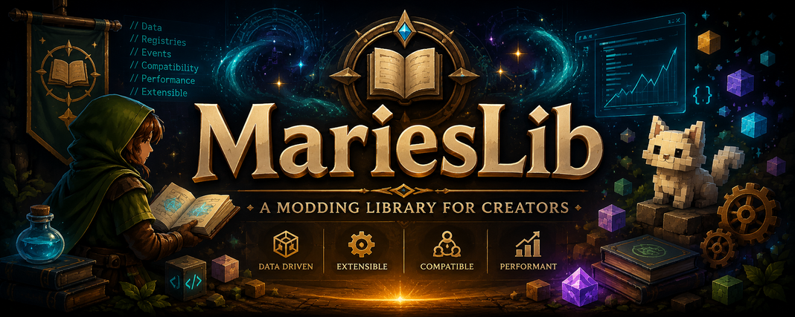
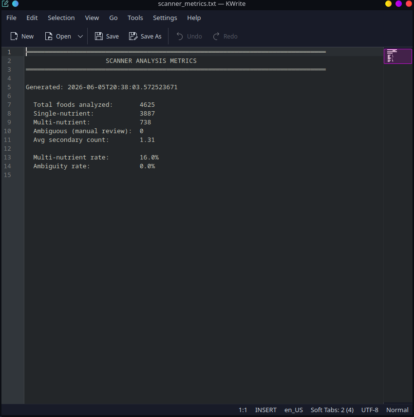
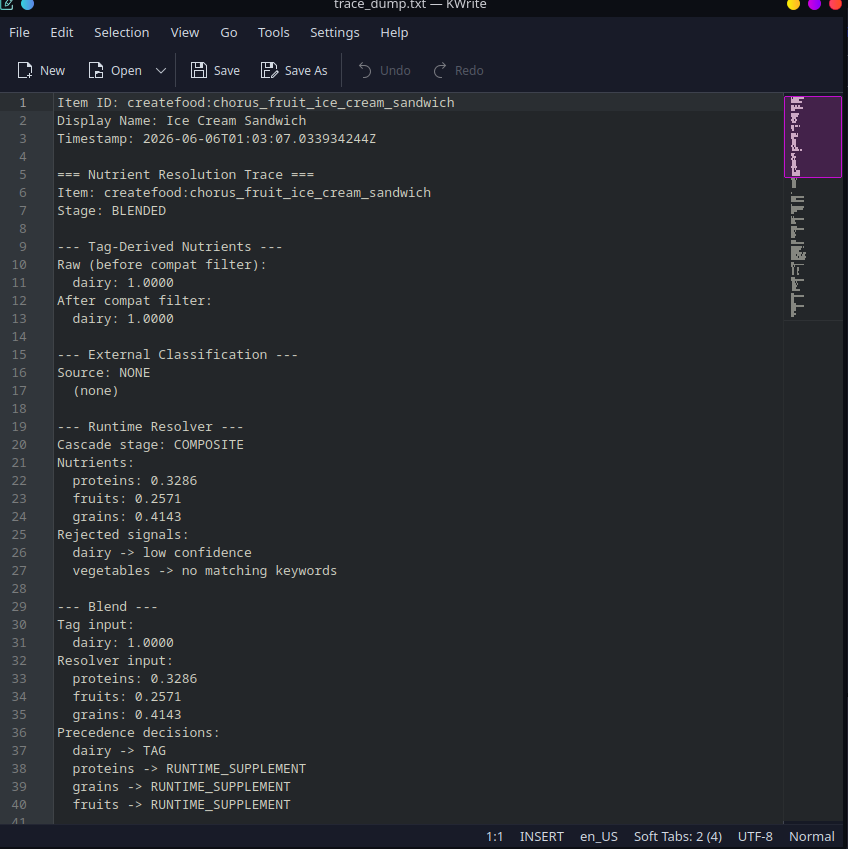
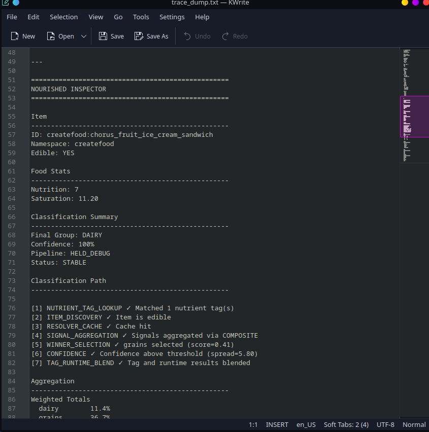
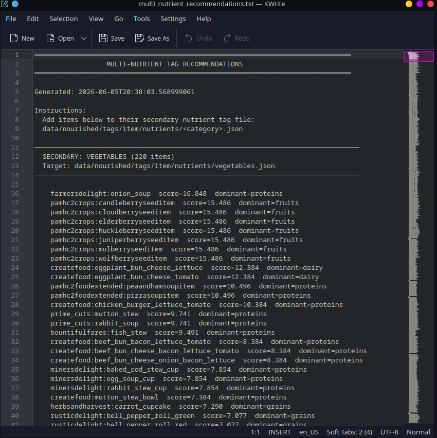
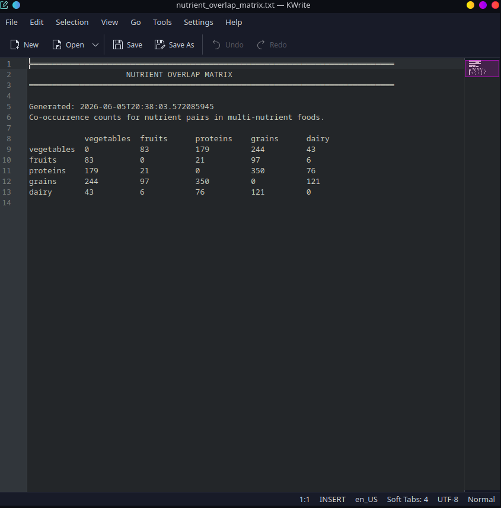

I kept rebuilding the same plumbing in every Marie mod, like registries, compat discovery, source
classification, caching, JSON helpers. It worked, but it was duplicated everywhere and painful
to maintain.

So I pulled it out into one library. **MariesLib** is the shared backbone behind mods like
[Nourished](https://modrinth.com/mod/nourished). It handles the hard problems, auto-classifying
thousands of items from modded content, three-tier compat with modpack overrides, player tracking
with memory and decay, datapack tooling with validation, so consuming mods can focus on gameplay.

---

## Community

Discord: [https://discord.gg/EZnFJsfQup](https://discord.gg/EZnFJsfQup)

Questions, suggestions, and development discussion are welcome.

---

## Do you need to install this?

**Yes — if you use a Marie mod that depends on it.**

Every Marie mod requires MariesLib as a **separate install**. [Nourished](https://modrinth.com/mod/nourished),
for example, needs **MariesLib 1.0.0+** alongside it.

Install both:

- The Marie mod you want (e.g. Nourished)
- MariesLib 1.0.0 or newer

Most launchers resolve that dependency automatically. If a Marie mod fails to load, check that
MariesLib is installed and up to date.

MariesLib is infrastructure, not a gameplay mod on its own. It powers the mods that depend on it.

---

## The Scanner

This is the auto-magic if everyone asks about.

Run the scanner and MariesLib analyzes **every source item** in your modpack — Farmer's Delight,
Croptopia, Pam's HarvestCraft, Create, and hundreds more — then writes ready-to-use datapack files.



**4,625 foods classified.** 738 multi-nutrient items. 16% multi-nutrient rate. Zero ambiguous entries.

Nourished never wrote classification rules for 90% of modded food — MariesLib figured it out through:

- **Token stemming**: tomato/tomatoes/cherry_tomato all collapse to the same root
- **Recipe inheritance**: if bread = grain, then toast = grain
- **Multi-signal analysis**: item name + food properties + existing tags
- **Confidence validation**: spread-based filtering, not hard thresholds

The scanner outputs:

- **Tag recommendations**: ready-to-paste JSON for `data/<modid>/tags/item/`
- **Multi-nutrient reports**: items with secondary groups (e.g. "pizza = grains + proteins")
- **Overlap matrices**: co-occurrence counts for multi-nutrient pairs
- **Ambiguous item lists**: low-confidence hits flagged for manual review

---

## Classification Traces

Every classification decision is inspectable. See exactly which pipeline stage matched, what
scores were considered, and why the final group was chosen.



**Ice Cream Sandwich** trace:

- **Tag lookup** → dairy: 1.0000
- **Runtime resolver** → proteins: 0.3286, fruits: 0.2571, grains: 0.4143
- **Blend precedence** → **TAG wins** (tag data takes priority over runtime)
- **Final group**: DAIRY, 100% confidence



The trace shows every stage:

1. NUTRIENT_TAG_LOOKUP ✓ — matched 1 nutrient tag
2. ITEM_DISCOVERY ✓ — item is edible
3. RESOLVER_CACHE ✓ — cache hit
4. SIGNAL_AGGREGATION ✓ — signals aggregated via COMPOSITE
5. WINNER_SELECTION ✓ — grains selected (score=0.41)
6. CONFIDENCE ✓ — confidence above threshold (spread=5.80)
7. TAG_RUNTIME_BLEND ✓ — tag and runtime results blended

**Precedence decisions:**

- dairy → TAG (tag data wins)
- proteins → RUNTIME_SUPPLEMENT (runtime fills gaps)
- grains → RUNTIME_SUPPLEMENT
- fruits → RUNTIME_SUPPLEMENT

Developer gold. You can debug exactly why any item resolved the way it did.

---

## Broad Mod Compatibility

MariesLib uses a **three-tier compat system** so mod authors, addon authors, and modpack creators
can declare and override compatibility without recompiling:

| Tier | Source                                                          | Notes                     |
| ---- | --------------------------------------------------------------- | ------------------------- |
| 1    | `data/<modid>/compat/compat_registry.json` in the consuming mod | Base registry             |
| 2    | `data/<other_modid>/marie_compat.json` from loaded mods         | Mod-provided declarations |
| 3    | `config/<modid>/compat_overrides.json`                          | Modpack overrides         |

Later tiers merge into earlier entries rather than replacing them wholesale.

**Example compat entry:**

```json
{
  "modId": "farmersdelight",
  "category": "FOOD_MOD",
  "providesSourceTags": true,
  "namespaces": ["farmersdelight"]
}
```

| Integration     | Status                         |
| --------------- | ------------------------------ |
| KubeJS          | ✅ Scripting support           |
| Cloth Config    | ✅ Preset and import/export UI |
| JEI / REI / EMI | ✅ Tooltips in recipe viewers  |
| Any Marie mod   | ✅ Required separate install   |

---

## The Tracking System

MariesLib provides a complete player value tracking system with memory, decay, effects, and progression.

**What consuming mods get:**

- **Memory windows**: track recent consumption with configurable time/count windows
- **Diminishing returns**: same-source penalty to encourage variety
- **Debt tracking**: go negative, pay it back over time with decay
- **Streaks**: bonus for sustained variety across time windows
- **Source pair synergies**: combos like "apple + cheese = bonus"
- **Milestones**: cumulative goals with rewards
- **Thresholds**: critical/low/excess with customizable effects
- **Profiles**: different decay/threshold profiles per player or scenario

This is a **whole player progression system** in one library. Consuming mods wire it up through
`MarieLibContext` and get tracking, decay, effects, and UI hooks out of the box.

---

## Modularity

Marie mods built on MariesLib can toggle major features independently — source application,
decay, effects, HUD, toasts, and more. Modpack authors can lock modules server-side through
datapack module locks.

**Module cache**: hot-path feature flags cached for performance
**Lock registry**: server-side locks prevent client config overrides

---

## 🔧 Configurable to your server

Everything ships with sensible defaults. Consuming mods expose the rest:

- Toggle individual modules on or off
- Adjust decay rates and thresholds per value
- Override sources via `config/<modid>/source_overrides.json`
- Override compat via `config/<modid>/compat_overrides.json`
- Drive definitions through datapacks where loaders are available
- Save and share full config snapshots with a single share code

**Import/export** — compressed config share codes. Export your entire setup as a string, paste
it to a friend, they import instantly. Config presets ship as JSON under `config/<modid>/presets/`.

---

## Mods built on MariesLib

All Marie mods require MariesLib as a separate install.

| Mod                                             | Description                                                     |
| ----------------------------------------------- | --------------------------------------------------------------- |
| [Nourished](https://modrinth.com/mod/nourished) | Nutrition framework for NeoForge 1.21.1                         |
| MariePerfTools                                  | Block entity culling and performance tooling _(in development)_ |

---

## 🌐 For mod developers

MariesLib exposes a stable public API if you want to integrate with it:

```java
float level = MarieAPI.getValueLevel(player, "proteins");
MarieAPI.registerValue(definition);
MarieAPI.registerCompatEntry(definition);
MarieAPI.registerCustomEffect(thresholdEffect);
```

API elements are marked `@Stable`, `@Experimental`, or `@Internal` so you know exactly what
you can rely on.

**What you don't have to build:**

- Item classification without writing heuristics
- Compat without hardcoding mod IDs
- Player tracking without writing save/sync/decay logic
- Datapack loaders without writing JSON parsers
- Config presets without writing serialization
- Module toggles without writing feature flags
- Classification traces without writing debug tooling

Every Marie mod requires MariesLib as a **separate mod** on the classpath. There is no JarJar
bundling. Declare `marieslib` as a required dependency and wire your runtime through
`MarieLibContext` at bootstrap.

Addons can register custom values, source classifications, effects, compat entries, and events
through Java or KubeJS. Consuming mods can also ship datapack-only integrations without writing
Java code.

### API stability

`CompatDefinition` previously lived at `dev.maire.nourished.api.CompatDefinition` and has moved
to `dev.marie.MariesLib.compat.CompatDefinition`. This break occurred during the beta period.
Future breaking changes will be accompanied by a deprecation shim and changelog notice.

---

## 📦 Datapack Support

Consuming mods can drive MariesLib through datapacks with zero Java code where loaders are available:

**Working now:**

- **Source classification**: assign items to value keys under `data/<namespace>/<modid>/source_classifications/`
- **Compat entries**: declare mod compatibility under `data/<namespace>/<modid>/compat/`
- **Source families**: group related sources under `data/<namespace>/<modid>/source_families/`
- **Module locks**: lock features server-side under `data/<namespace>/<modid>/module_locks/`

**Schema defined, loaders still in progress:**

- `values/`, `effects/`, `synergies/`, `source_synergies/`, `milestones/`, `tracking_profiles/`

The scanner writes tag recommendations directly:



**220 vegetables** with scores and dominant nutrients, ready to paste into
`data/nourished/tags/item/nutrients/vegetables.json`.



**Co-occurrence matrix**: vegetables × proteins: 179, grains × proteins: 350. Shows which
nutrient pairs appear together in multi-nutrient foods. Useful for designing synergies and
understanding your modpack's food landscape.

---

## 🟨 KubeJS Support

KubeJS scripting support for value registration, source classifications, synergies, milestones,
and event hooks — no Java required.

```js
MarieAPI.registerValue({
    id: 'custom_value',
    displayName: 'Custom Value',
    decayRate: 0.02
})

MarieEvents.onValueChanged(event => {
    if (event.valueKey === 'custom_value' && event.level < 0.25) {
        event.player.tell('Your custom value is low!')
    }
})
```

---

## 🚧 Current Focus

- Completing remaining datapack loaders
- Expanding network sync infrastructure
- More diagnostic and validation tooling
- Broader third-party integration support

---

## Requirements

|               |            |
| ------------- | ---------- |
| **Minecraft** | **1.21.1** |
| **NeoForge**  | **21.1.x** |
| **Java**      | **21**     |

---

## License

LGPL-3.0-only

---

## Links

- [Modrinth](https://modrinth.com/mod/marieslib)
- [Nourished on Modrinth](https://modrinth.com/mod/nourished)
- [GitHub](https://github.com/kgbcupcake)
