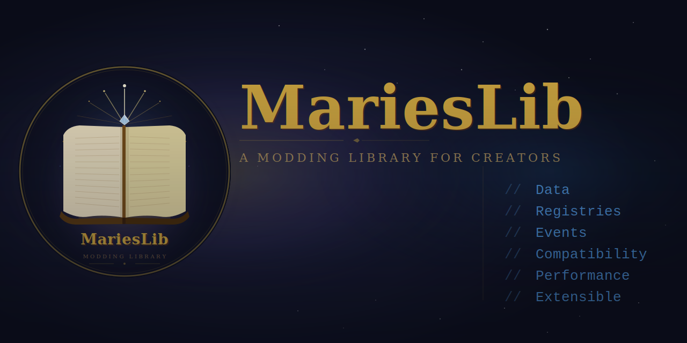

[](LICENSE) [](https://github.com/kgbcupcake/MarieLib/releases) [](https://github.com/kgbcupcake/MarieLib/stargazers) [](https://github.com/kgbcupcake/MarieLib/issues) [](https://www.minecraft.net) [](https://neoforged.net) [](https://deepwiki.com/kgbcupcake/MariesLib)



MariesLib is the shared backbone behind Marie mods: pulled out of Nourished so the reusable plumbing (item classification, player value tracking, compat discovery, tooltip customization, and a dynamic drag/resize UI framework) lives in one place instead of being rebuilt per mod.

Split into four modules: `marie-core`, `marie-commands`, `marie-resources`, `marie-ui`: for easier maintenance.

---

## Community

[Discord](https://discord.gg/EZnFJsfQup) — questions, suggestions, and development discussion welcome.

---

## Do you need to install this?

**Yes, if you use any Marie mod that depends on it.** Every Marie mod requires MariesLib as a **separate install**: there is no JarJar bundling.

Install both:

- The Marie mod you want
- MariesLib, matching (or newer than) the version that mod requires

Most launchers resolve this automatically. If a Marie mod fails to load, check that MariesLib is installed and up to date.

---

## What MariesLib actually does

### Item classification & scanning

`ItemScanner` walks every item in your modpack and classifies it via a cascading signal pipeline, community tags, namespace matching, keyword/suffix matching, recipe-ingredient inheritance — producing confidence-scored results. Run it in-game via `/marie scan`. It's how a mod like Nourished can auto-classify thousands of modded food items without hand-written per-item mappings.

The scanner's behavior (weight tables, thresholds, multipliers) is configured through `ScannerSpecRegistry`, itself overridable per-server (`config/<modid>/scanner_spec.json`) or per-modpack (datapack).

At actual gameplay time, `RuntimeResolver` does the same classification job live and cached (not the offline batch scan), with `ComponentClassifier` handling ingredient/sub-component lookups separately to avoid recursion.

Two override/opt-out layers sit on top of whatever the classifier produces:

- **`SourceClassificationRegistry`**: manual per-item value overrides for modpack authors
- **`ExcludedItemsRegistry`** — a flat opt-out list; excluded items are never classified or tracked at all

Every classification decision is inspectable: trace exactly which pipeline stage matched, what scores were considered, and why the final result was chosen.

### Player value tracking

A complete tracking system for mods that need player-facing bars: decay, thresholds, effects, memory-based diminishing returns, source-pair synergies, milestones, and profiles. Wired up per-mod through `MarieContext`.

- **Memory**: recent source applications tracked per item, category, and family, each with its own diminishing-returns curve
- **Thresholds**: critical/low/excess bands per value, each able to trigger a `ThresholdEffect`
- **Synergies**: bonus conditions across two value levels (`SynergyDefinition`) or two specific sources (`SourcePairSynergy`)
- **Milestones**: cumulative goals with reward effects/advancements

### Tooltip customization

`TooltipColorRegistry` / `TooltipMessageRegistry` let a consuming mod expose per-key and per-item tooltip text/color, overridable at two tiers: `config/<modId>/tooltips/*.json` (server owner) and `data/<modId>/marie/tooltips/*.json` (datapack, wins). Unlike other registries, these don't ship built-in defaults — a consuming mod calls `seedDefaultsIfAbsent(...)` to provide its own.

### Dynamic UI (`marie-ui`)

A drag/resize component framework for building editable HUD and screen panels: `MarieComponent` is the base contract, `DraggableResizable` handles the drag/resize gesture tracking (snap-to-siblings, per-edge and per-corner handles, parent-bounds clamping), and `ModuleRegistry` lets a consuming mod register a set of pluggable panel modules under a shared key so multiple screens/regions can each maintain an independent ordered module list.

### Broad mod compatibility

A three-tier compat system so mod authors, addon authors, and modpack creators can declare and override compatibility without recompiling:

| Tier | Source                                         | Notes                                 |
| ---- | ---------------------------------------------- | ------------------------------------- |
| 1    | Bundled `mod_compat.json` in the consuming mod | Base registry                         |
| 2    | Mod-provided `CompatDefinition` registrations  | Discovered at runtime via `ModCompat` |
| 3    | `config/<modid>/compat_overrides.json`         | Modpack overrides                     |

| Integration     | Status                         |
| --------------- | ------------------------------ |
| KubeJS          | ✅ Scripting support           |
| Cloth Config    | ✅ Preset and import/export UI |
| JEI / REI / EMI | ✅ Tooltips in recipe viewers  |
| Any Marie mod   | ✅ Required separate install   |

---

## Getting started

Add MariesLib as a compile-time dependency:

```gradle
repositories {
    maven { url = "https://maven.pkg.github.com/kgbcupcake/MariesLib" }
}

dependencies {
    compileOnly "dev.marie.MariesLib:marieslib:<version>"
}
```

At runtime, MariesLib must be installed as a separate mod.

There are two real bootstrap patterns, depending on whether your mod needs player value tracking:

**Full value-tracking mod** (e.g. Nourished):

```java
@Mod("examplemod")
public final class ExampleMod {
    public ExampleMod(IEventBus modBus) {
        MarieBootstrap.attach("examplemod", modBus);

        MarieAPI.registerValue(ValueDefinition.builder("emc")
                .displayName("EMC")
                .color(0xFF44AAFF)
                .defaultDecayRate(0.002f)
                .build());
    }
}
```

`MarieBootstrap.attach(modId, modEventBus)` is the one-call path: it registers a default `MarieContext`, wires data attachments, registers the value-tracking registries and event listeners, and freezes them after common setup. Guard your mod so it doesn't crash if MariesLib is somehow absent — check `ModList.get().isLoaded("marieslib")` if you support optional integration.

**Lightweight mod, no value tracking** (e.g. Thermal Systems):

```java
public final class ThermalSystemsMod {
    public ThermalSystemsMod(IEventBus modBus) {
        MarieBootstrap.attachFrameworkServices(modBus);
    }
}

// separately, e.g. client-side wiring:
MarieContext.register(
    MarieContext.builder("thermalsystems")
        .configScreenFactory(...)
        .exportScreenFactory(...)
        .importScreenFactory(...)
        .build()
);
```

`attachFrameworkServices` is idempotent and only wires the domain-agnostic pieces (block-hover data, generic state sync), no value-tracking machinery. Use this if your mod only needs the UI framework, compat system, or hover data, not player bars.

All `MarieAPI.register*` calls must happen during mod initialization, your `@Mod` constructor or an `FMLCommonSetupEvent` handler. The registration window closes after init; calling register outside it throws `IllegalStateException`.

---

## For mod developers

See [API.md](API.md) for the full reference, every `@ApiStatus.Stable`/`Experimental` class, method, and datapack path, verified directly against source.

```java
float level = MarieAPI.getValueLevel(player, "emc");
MarieAPI.registerValue(definition);
MarieAPI.registerCompatEntry(definition);
MarieAPI.registerCustomEffect(thresholdEffect);
```

API elements are marked `@Stable`, `@Experimental`, or `@Internal`:

- **`@Stable`**: safe for released addons, no breaking signature changes within a minor version
- **`@Experimental`**: may change any release; most of `marie-ui` and all of KubeJS support falls here
- **`@Internal`**: not a public contract, do not import

---

## KubeJS support

Scripting support for value registration, source classifications, synergies, milestones, and event hooks, no Java required. Experimental; may change between releases.

```js
MarieAPI.registerValue({
    id: 'custom_value',
    displayName: 'Custom Value',
    decayRate: 0.02
})

MarieEvents.valueChanged(event => {
    if (event.valueKey === 'custom_value' && event.newValue < 0.25) {
        event.player.tell('Your custom value is low!')
    }
})
```

Full event list and bindings in [API.md](API.md#kubejs).

---

## Mods built on MariesLib

| Mod                                             | Description                             |
| ----------------------------------------------- | --------------------------------------- |
| [Nourished](https://modrinth.com/mod/nourished) | Nutrition framework for NeoForge 1.21.1 |
| **Thermal Systems**                             | TBA                                     |

---

## Requirements

|               |            |
| ------------- | ---------- |
| **Minecraft** | **1.21.1** |
| **NeoForge**  | **21.1.x** |
| **Java**      | **21**     |

---

## License

LGPL-3.0-only

---

## Links

- [Modrinth](https://modrinth.com/mod/marieslib)
- [GitHub](https://github.com/kgbcupcake)
- [API.md](API.md)
- [Changelog](CHANGELOG.md)
